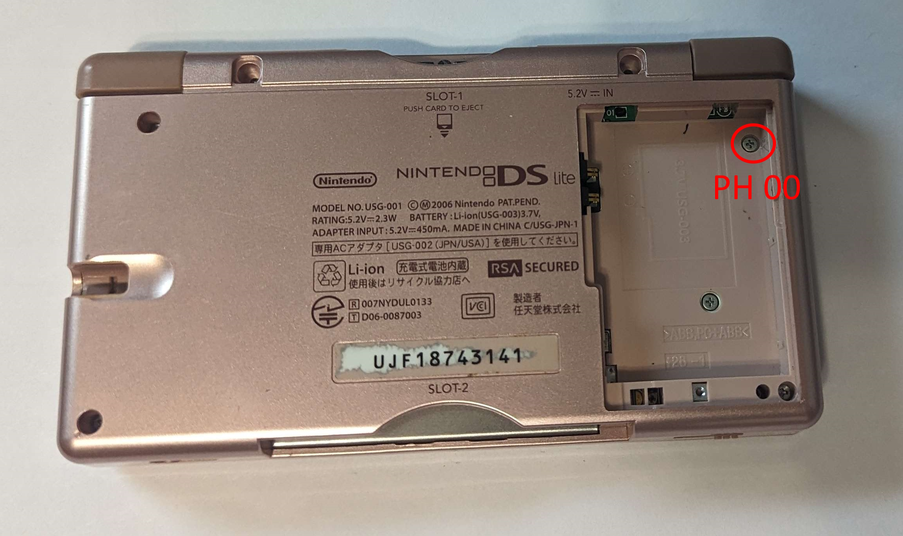

> We're still in the early stages of development, if you notice any issues, report them to [github](https://github.com/WurmForge/wiki).

## Step 1. Flip the DS Lite upside down, on the back.

## Step 2. Remove the Dust covers.
- Inside slot 2 (GBA Slot), and optionally the stylus.

## Step 3. Remove the screw covers. 
- Using somne fine point tweasers or an neddle.

## Step 4. Remove the screws

## Step 5. Remove the battery cover

## Step 6. Remove the battery

## Step 7. Remove the screw

## Step 8. Remove the screws (4 total)

## Step 9. Remove the back shell. 
- Slide a plastic guitar pic into the side and move it around the edge, it should just pop off.

## Step 10. Remove the Physical Triggers

## Step 11. Remove the screws

## Step 12. Remove the Wifi Card
- To remove, just pull up.
- Just pop off, the black or blue wire on the wifi card, once its been removed./

## Step 13. Remove the mic wire

## Step 14. Pop out the motherboard
- Be careful of the ribbons and wires, they are still connected.

## Step 15. Cleaning the triggers
- Inject some Isopropol Alcohol 91% or better into the triggers, just a few drops. 
- Once this has been done, keep pushing the button for like 10-20 seconds or until its dried, then wait a few minutes for it to fully dry. then repeat, 2 - 3 times.
- then reassemble and test, if they still are having issues they are defective and needs to be replaced. See [Replacing Triggers](Replacing-Triggers)
- 

## Step 16+ Reassembly Notes.
- Mostly just do the guide in reverse however there's a few notes, you should look at before that.

- Make sure the Mic wire is on this side of the post, it will make it easier to insert the board.

- Make sure the Mic wire is under the board and comes out here.

- Make sure the spring on the trigger is between the 2 posts.

- Make sure the spring on the trigger is between the 2 posts.

- Make sure the volume slider is to one of the sides (I generally to the right side).

- Make sure the slider on the outer shell is also on the same side, if not you risk breaking it off.

- Make sure the power switch slider on the outer shell is in the down position.

