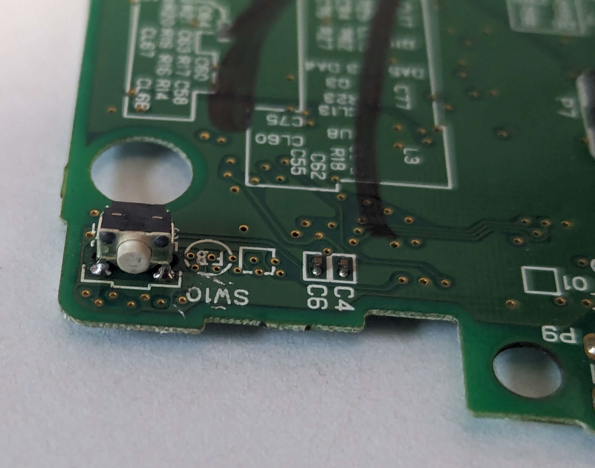

# Common Issues

> We're still in the early stages of development, if you notice any issues, report them to [github](https://github.com/WurmForge/wiki).

## Triggers
Having Left or Right trigger issues?

Are they registering most the time? - If so they may just need to be cleaned, see [Cleaning Triggers](../cleaning-triggers)

Nothing is registering or you have to push it very hard to get anything? If so they are likely worn beyond repair, and will need to be replaced. See [Replacing Triggers](../replacing-triggers)

## D-Pad or Buttons
Buttons not registering? Do they not really push or one of them just feel off?

Does pushing down hard allow them to register? do they feel crusty or sticky? If so see [Cleaning Membranes](../cleaning-the-buttons)

Do they not feel right? or one is diffrent than the rest? If so see [Replacing Membranes](../cleaning-the-buttons)

## Screen Issues
Top screen glitching out? Cracked? dead pixels?

For most screen issues it will require it to be replaced. See below for your specific screen.

- [Replacing Top LCD](../replacing-top-lcd)

- [Replacing Bottom LCD](../replacing-bottom-lcd)

For scratches on the bottom, see [Replacing The Digitizer](../replacing-the-digitizer)

For top screen scratches see [Replacing the Top LCD Lens](../replacing-top-lens)

## Hinge
Cracked Hinge? Lose/Weak Hinge?

Generally this problem is not really fixable, but you've got a few options.

- Replacing the hinge area. see [Replacing Midframe](../replacing-midframe)
- Reshelling into another shell, see [Reshelling](../reshelling)
- Gameboy Macro Lite Mod see [Building A Macro Lite](../macro-lite)

## Power Issues
No Power, Wont Charge? Flashes?

See [Power Issues Guide](../power-issues-guide)
