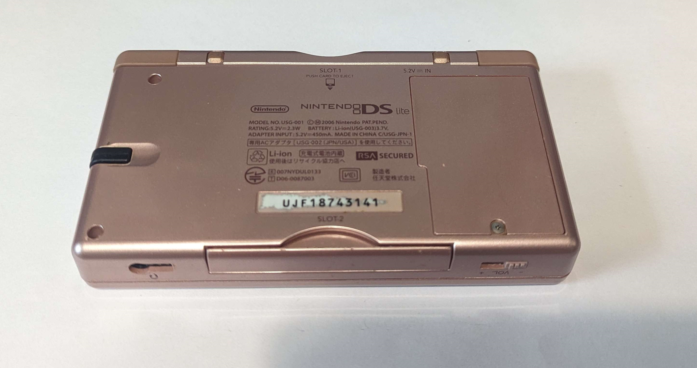
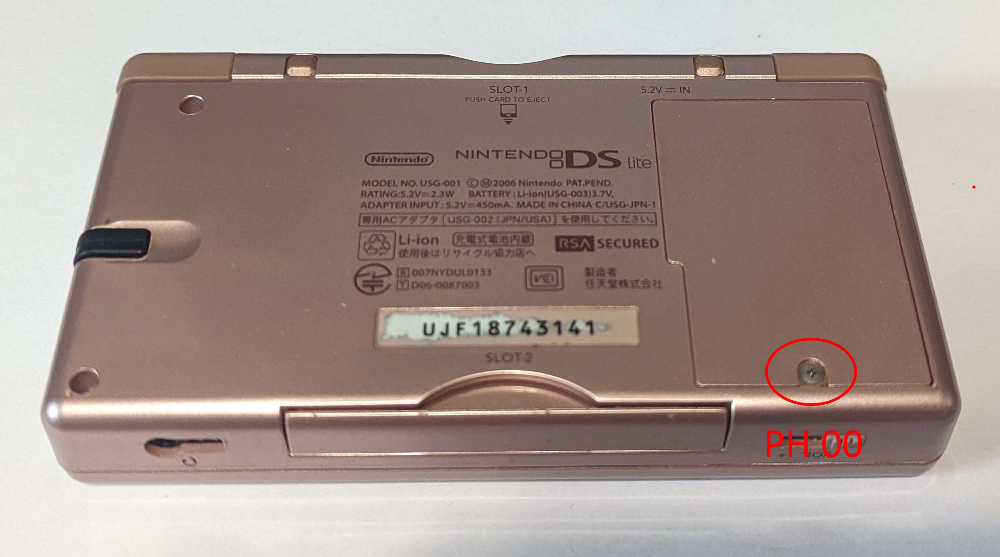
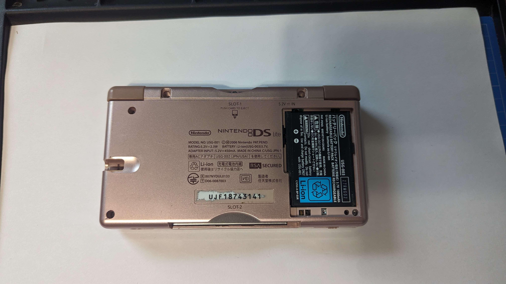
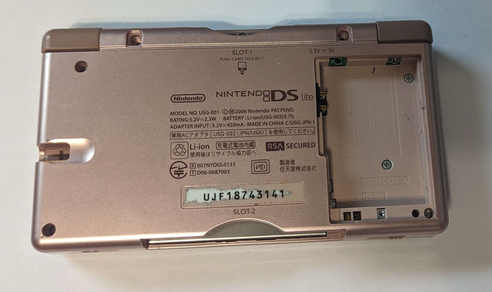

> We're still in the early stages of development, if you notice any issues, report them to [github](https://github.com/WurmForge/wiki).

## Step 1. Flip the DS Lite upside down, on the back.

## Step 2. Remove the screws

## Step 3. Remove the battery cover

## Step 4. Remove the battery.
